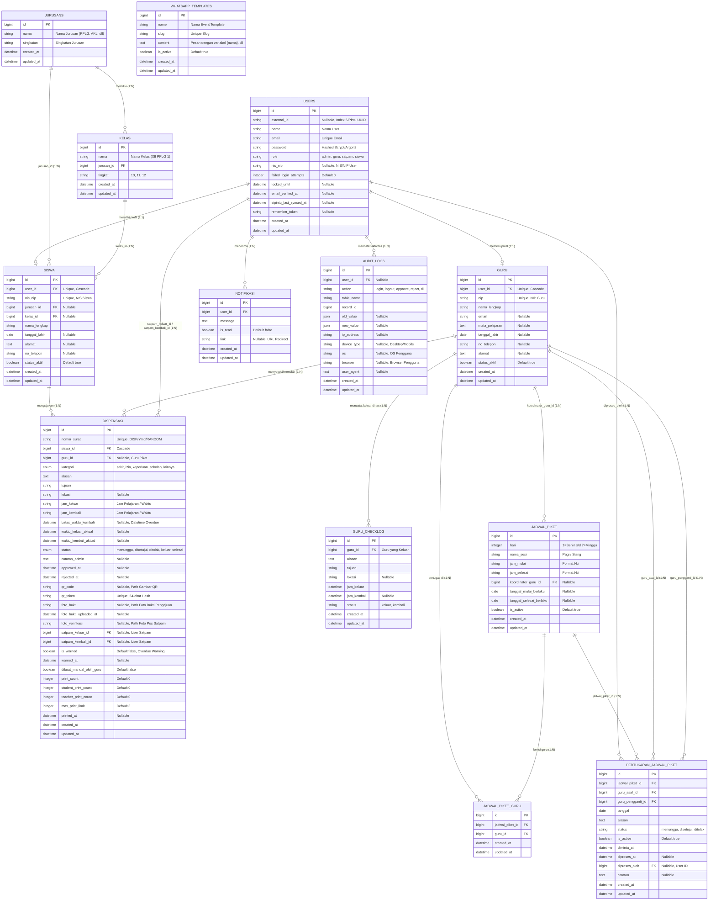

# ENTITY RELATIONSHIP DIAGRAM (ERD) & DATA DICTIONARY
## SISTEM DISPENSASI SISWA DIGITAL (DIDISPEN)
**SMK NEGERI 1 BANGSRI**

Dokumentasi rancangan basis data (*database schema*) dan relasi antar-entitas untuk aplikasi **DIDISPEN** berbasis Laravel 11 dan MySQL/MariaDB.

---

## 1. Visualisasi Diagram ERD (Mermaid)

---

## 2. Kamus Data & Spesifikasi Entitas (Data Dictionary)

### 2.1 Tabel `users`
Menyimpan akun pengguna utama untuk autentikasi terpusat (Role-Based Access Control) dan integrasi SiPintu Identity Gateway.

| Nama Kolom | Tipe Data | Nullable | Keterangan |
| :--- | :--- | :---: | :--- |
| `id` | BIGINT UNSIGNED | Tidak | Primary Key (Auto Increment). |
| `external_id` | VARCHAR(255) | Ya | UUID akun pengguna dari SiPintu Gateway (Indexed). |
| `name` | VARCHAR(255) | Tidak | Nama display akun pengguna. |
| `email` | VARCHAR(255) | Tidak | Alamat email unik untuk login. |
| `email_verified_at`| TIMESTAMP | Ya | Waktu verifikasi email. |
| `password` | VARCHAR(255) | Tidak | Hash password (Bcrypt/Argon2). |
| `role` | ENUM | Tidak | Hak akses: `'admin'`, `'guru'`, `'satpam'`, `'siswa'`. |
| `nis_nip` | VARCHAR(50) | Ya | Nomor Induk Siswa (NIS) atau NIP Guru untuk login alternatif. |
| `failed_login_attempts` | INT | Tidak | Penghitung gagal login untuk proteksi anti-brute force (Default 0). |
| `locked_until` | TIMESTAMP | Ya | Waktu akhir lockout akun jika 5x berturut-turut gagal login. |
| `sipintu_last_synced_at` | TIMESTAMP | Ya | Waktu terakhir data disinkronkan dari SiPintu (*Conflict Resolution*). |
| `remember_token`| VARCHAR(100) | Ya | Token "Ingat Saya" sesi login Laravel. |
| `created_at` / `updated_at` | TIMESTAMP | Ya | Jejak waktu pembuatan dan pembaruan data. |

---

### 2.2 Tabel `siswa`
Profil terperinci peserta didik yang terhubung dengan akun `users`, `kelas`, dan `jurusans`.

| Nama Kolom | Tipe Data | Nullable | Keterangan |
| :--- | :--- | :---: | :--- |
| `id` | BIGINT UNSIGNED | Tidak | Primary Key. |
| `user_id` | BIGINT UNSIGNED | Tidak | Foreign Key ke `users.id` (Unique, On Delete Cascade). |
| `nis_nip` | VARCHAR(50) | Ya | Nomor Induk Siswa (Unique). |
| `jurusan_id` | BIGINT UNSIGNED | Ya | Foreign Key ke `jurusans.id`. |
| `kelas_id` | BIGINT UNSIGNED | Ya | Foreign Key ke `kelas.id`. |
| `nama_lengkap` | VARCHAR(255) | Tidak | Nama lengkap siswa sesuai dapodik. |
| `tanggal_lahir` | DATE | Ya | Tanggal lahir siswa. |
| `alamat` | TEXT | Ya | Alamat tempat tinggal. |
| `no_telepon` | VARCHAR(30) | Ya | Nomor WhatsApp siswa / orang tua untuk notifikasi. |
| `status_aktif` | BOOLEAN | Tidak | Status aktif belajar siswa (Default `true`). |
| `created_at` / `updated_at` | TIMESTAMP | Ya | Timestamps. |

---

### 2.3 Tabel `guru`
Profil tenaga pendidik dan guru piket yang memiliki wewenang verifikasi dispensasi.

| Nama Kolom | Tipe Data | Nullable | Keterangan |
| :--- | :--- | :---: | :--- |
| `id` | BIGINT UNSIGNED | Tidak | Primary Key. |
| `user_id` | BIGINT UNSIGNED | Tidak | Foreign Key ke `users.id` (Unique, On Delete Cascade). |
| `nip` | VARCHAR(50) | Tidak | Nomor Induk Pegawai Guru (Unique). |
| `nama_lengkap` | VARCHAR(255) | Tidak | Nama lengkap dan gelar guru. |
| `email` | VARCHAR(255) | Ya | Email guru (Google / Pribadi). |
| `mata_pelajaran` | TEXT | Ya | Mata pelajaran yang diampu. |
| `tanggal_lahir` | DATE | Ya | Tanggal lahir guru. |
| `no_telepon` | VARCHAR(30) | Ya | Nomor WhatsApp aktif untuk notifikasi piket. |
| `alamat` | TEXT | Ya | Alamat tempat tinggal. |
| `status_aktif` | BOOLEAN | Tidak | Status aktif dinas guru (Default `true`). |
| `created_at` / `updated_at` | TIMESTAMP | Ya | Timestamps. |

---

### 2.4 Tabel `jurusans` & `kelas`
Master data akademik tingkat sekolah.
* **`jurusans`**: `id` (PK), `nama` (e.g. *Pengembangan Perangkat Lunak dan Gim*), `singkatan` (e.g. *PPLG*).
* **`kelas`**: `id` (PK), `nama` (e.g. *XII PPLG 1*), `jurusan_id` (FK ke `jurusans`), `tingkat` (`'10'`, `'11'`, `'12'`).

---

### 2.5 Tabel `dispensasi` (Entitas Transaksional Inti)
Menyimpan seluruh data siklus pengajuan izin dispensasi siswa.

| Nama Kolom | Tipe Data | Nullable | Keterangan |
| :--- | :--- | :---: | :--- |
| `id` | BIGINT UNSIGNED | Tidak | Primary Key. |
| `nomor_surat` | VARCHAR(100) | Tidak | Format nomor resmi unik: `DISP/YYYYMMDD/XXXXXX`. |
| `siswa_id` | BIGINT UNSIGNED | Tidak | Foreign Key ke `siswa.id` (Pemohon/Perwakilan rombongan). |
| `guru_id` | BIGINT UNSIGNED | Ya | Foreign Key ke `guru.id` (Guru Piket yang memproses). |
| `kategori` | ENUM | Tidak | `'sakit'`, `'izin'`, `'keperluan_sekolah'`, `'lainnya'`. |
| `alasan` | TEXT | Tidak | Deskripsi keperluan/alasan dispensasi. |
| `tujuan` | VARCHAR(255) | Tidak | Tempat/instansi tujuan dispensasi. |
| `lokasi` | VARCHAR(255) | Ya | Lokasi spesifik tujuan izin. |
| `jam_keluar` | VARCHAR(50) | Tidak | Jam keluar (fleksibel: `"10:15"` atau `"Jam Pelajaran ke-4"`). |
| `jam_kembali` | VARCHAR(50) | Tidak | Jam kembali (fleksibel: `"12:30"` atau `"Jam Pelajaran ke-7"`). |
| `batas_waktu_kembali`| DATETIME | Ya | Timestamp evaluasi otomatis keterlambatan (*overdue*). |
| `waktu_keluar_aktual`| DATETIME | Ya | Waktu aktual siswa keluar saat di-scan Satpam di pos gerbang. |
| `waktu_kembali_aktual`| DATETIME | Ya | Waktu aktual siswa kembali saat di-scan Satpam di pos gerbang. |
| `status` | ENUM | Tidak | Status: `'menunggu'`, `'disetujui'`, `'ditolak'`, `'keluar'`, `'selesai'`. |
| `catatan_admin` | TEXT | Ya | Alasan penolakan dari guru piket atau catatan tambahan. |
| `approved_at` / `rejected_at` | DATETIME | Ya | Timestamp persetujuan atau penolakan permohonan. |
| `qr_code` | VARCHAR(255) | Ya | Path file gambar QR Code yang di-generate sistem. |
| `qr_token` | VARCHAR(64) | Tidak | Token terenkripsi 64 karakter untuk pemindaian aman di pos satpam. |
| `foto_bukti` | VARCHAR(255) | Ya | Path file unggahan surat/bukti kegiatan dari siswa. |
| `foto_verifikasi` | VARCHAR(255) | Ya | Path file foto fisik siswa yang dijepret Satpam di pos jaga. |
| `satpam_keluar_id` | BIGINT UNSIGNED | Ya | Foreign Key ke `users.id` (Petugas satpam saat keluar). |
| `satpam_kembali_id`| BIGINT UNSIGNED | Ya | Foreign Key ke `users.id` (Petugas satpam saat kembali). |
| `is_warned` / `warned_at` | BOOLEAN / DATETIME | Tidak / Ya | Flag penanda notifikasi keterlambatan/overdue terkirim. |
| `dibuat_manual_oleh_guru`| BOOLEAN | Tidak | Penanda jika izin dibuatkan langsung di tempat oleh guru piket. |
| `print_count` | INT | Tidak | Akumulasi cetak struk (Default 0). |
| `student_print_count` | INT | Tidak | Batas cetak mandiri oleh siswa (Default 0). |
| `teacher_print_count` | INT | Tidak | Batas cetak oleh guru piket (Default 0). |
| `max_print_limit` | INT | Tidak | Batas kuota cetak per dispensasi (Default 3). |
| `printed_at` | DATETIME | Ya | Waktu pencetakan struk terakhir. |

---

### 2.6 Tabel `guru_checklog`
Mencatat ketersediaan dan mobilitas dinas luar guru selama jam sekolah.
* `id` (PK)
* `guru_id` (FK ke `guru.id`)
* `alasan`, `tujuan`, `lokasi` (Detail penugasan luar)
* `jam_keluar` (Datetime waktu guru berangkat)
* `jam_kembali` (Datetime waktu estimasi atau aktual guru tiba kembali)
* `status` (Tanda status: `'keluar'`, `'kembali'`)

---

### 2.7 Tabel `jadwal_piket`, `jadwal_piket_guru`, & `pertukaran_jadwal_piket`
* **`jadwal_piket`**: `id` (PK), `hari` (1=Senin s/d 7=Minggu), `nama_sesi` (*Pagi/Siang*), `jam_mulai`, `jam_selesai`, `koordinator_guru_id` (FK ke `guru`), `is_active`.
* **`jadwal_piket_guru`**: Pivot table Many-to-Many antara `jadwal_piket_id` dan `guru_id`.
* **`pertukaran_jadwal_piket`**: `id` (PK), `jadwal_piket_id` (FK), `guru_asal_id` (FK), `guru_pengganti_id` (FK), `tanggal`, `alasan`, `status` (*menunggu, disetujui, ditolak*), `diproses_oleh` (FK ke `users`).

---

### 2.8 Tabel Pendukung: `whatsapp_templates`, `notifikasi`, & `audit_logs`
* **`whatsapp_templates`**: Menyimpan template pesan dinamis bot WA (`slug`, `content`, `is_active`).
* **`notifikasi`**: Pesan pemberitahuan in-app dashboard (`user_id`, `message`, `is_read`, `link`).
* **`audit_logs`**: Catatan jejak audit sistem (`user_id`, `action`, `table_name`, `record_id`, `old_value`, `new_value`, `ip_address`, `device_type`, `os`, `browser`, `user_agent`). Menggunakan trait *Prunable* 24 jam untuk menjaga efisiensi database.

---

## 3. Matriks Relasi Antar-Entitas (Cardinallity)

| Entitas Asal | Relasi | Entitas Tujuan | Tipe Relasi | Keterangan Bisnis |
| :--- | :---: | :--- | :---: | :--- |
| `users` | 1 $\rightarrow$ 1 | `siswa` | One-to-One | 1 akun user siswa memiliki 1 data biodata siswa. |
| `users` | 1 $\rightarrow$ 1 | `guru` | One-to-One | 1 akun user guru memiliki 1 data biodata guru. |
| `jurusans` | 1 $\rightarrow$ N | `kelas` | One-to-Many | 1 program keahlian/jurusan menaungi banyak rombel kelas. |
| `kelas` | 1 $\rightarrow$ N | `siswa` | One-to-Many | 1 rombel kelas terdiri dari banyak siswa. |
| `siswa` | 1 $\rightarrow$ N | `dispensasi` | One-to-Many | 1 siswa dapat mengajukan dispensasi berulang kali. |
| `guru` | 1 $\rightarrow$ N | `dispensasi` | One-to-Many | 1 guru piket memverifikasi banyak pengajuan siswa. |
| `users` (Satpam) | 1 $\rightarrow$ N | `dispensasi` | One-to-Many | 1 satpam memvalidasi scan keluar & kembali banyak siswa. |
| `guru` | 1 $\rightarrow$ N | `guru_checklog` | One-to-Many | 1 guru memiliki riwayat checklog dinas luar. |
| `jadwal_piket` | N $\rightarrow$ M | `guru` | Many-to-Many | Dihubungkan via tabel perantara `jadwal_piket_guru`. |
| `guru` | 1 $\rightarrow$ N | `pertukaran_jadwal_piket` | One-to-Many | Guru dapat mengajukan atau menerima tukar jadwal piket. |
| `users` | 1 $\rightarrow$ N | `audit_logs` | One-to-Many | Semua aksi pengguna terekam ke log audit keamanan. |