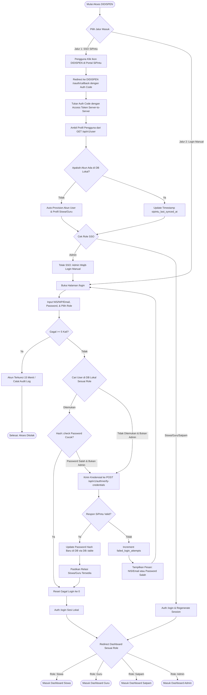
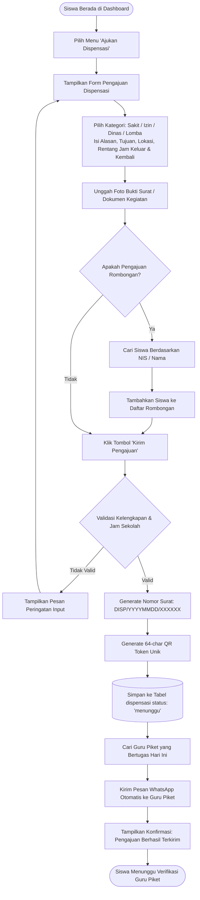
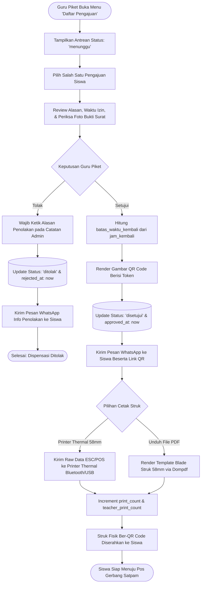
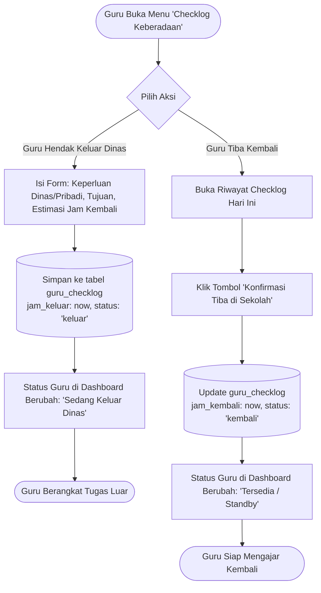
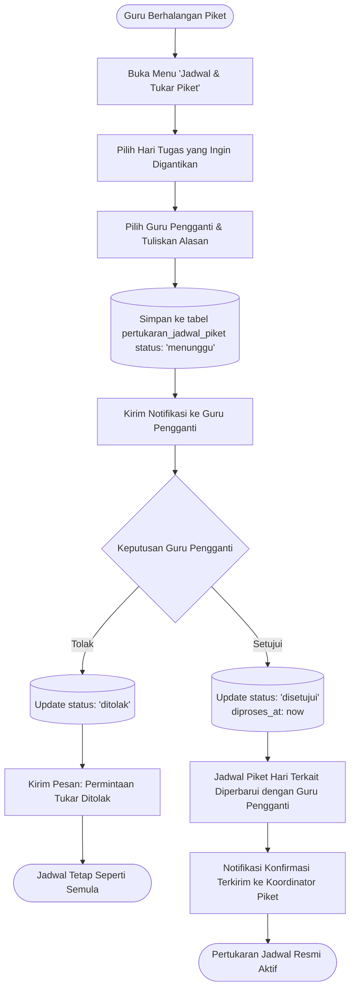
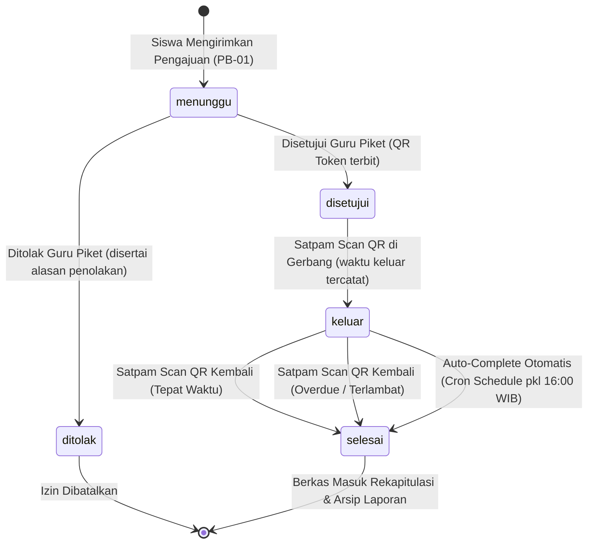

# SYSTEM FLOWCHARTS & PROCESS WORKFLOWS
## SISTEM DISPENSASI SISWA DIGITAL (DIDISPEN)
**SMK NEGERI 1 BANGSRI**

Dokumentasi diagram alir (*flowchart*) operasional sistem **DIDISPEN** yang memetakan seluruh interaksi pengguna (Siswa, Guru Piket, Satpam, Admin) dan integrasi eksternal (SiPintu Gateway, WhatsApp Bot, Scanner Gerbang, & Thermal Printer).

---

## DAFTAR ISI DIAGRAM ALIR
1. [Flowchart 1: Autentikasi Multi-Role & Model Hybrid SiPintu SSO](#flowchart-1-autentikasi-multi-role--model-hybrid-sipintu-sso)
2. [Flowchart 2: Pengajuan Dispensasi Online oleh Siswa](#flowchart-2-pengajuan-dispensasi-online-oleh-siswa)
3. [Flowchart 3: Verifikasi, Persetujuan, & Cetak Struk Guru Piket](#flowchart-3-verifikasi-persetujuan--cetak-struk-guru-piket)
4. [Flowchart 4: Pemindaian QR Code Pos Satpam & Deteksi Overdue](#flowchart-4-pemindaian-qr-code-pos-satpam--deteksi-overdue)
5. [Flowchart 5: Pencatatan Keberadaan Guru (Guru Checklog)](#flowchart-5-pencatatan-keberadaan-guru-guru-checklog)
6. [Flowchart 6: Manajemen & Pertukaran Jadwal Guru Piket](#flowchart-6-manajemen--pertukaran-jadwal-guru-piket)
7. [Flowchart 7: State Machine Siklus Status Dispensasi](#flowchart-7-state-machine-siklus-status-dispensasi)

---

## Flowchart 1: Autentikasi Multi-Role & Model Hybrid SiPintu SSO

Diagram ini memetakan 2 jalur masuk aplikasi DIDISPEN: **Jalur 1 (SSO Terpusat via SiPintu)** dan **Jalur 2 (Form Login Mandiri dengan Fallback Real-Time)**.



---

## Flowchart 2: Pengajuan Dispensasi Online oleh Siswa

Alur pengajuan izin dispensasi oleh siswa secara mandiri ataupun rombongan kegiatan.



---

## Flowchart 3: Verifikasi, Persetujuan, & Cetak Struk Guru Piket

Alur kerja Guru Piket dalam memproses antrean pengajuan dispensasi siswa dan pencetakan bukti fisik perizinan.



---

## Flowchart 4: Pemindaian QR Code Pos Satpam & Deteksi Overdue

Alur pemeriksaan perizinan 2 arah di gerbang sekolah oleh petugas Satpam (saat keluar dan kembali).

```mermaid
flowchart TD
    StartSatpam([Satpam Buka Portal Scanner Kamera Pos Gerbang]) --> SiswaArrive[Siswa Tiba di Pos Memperlihatkan QR Code]
    SiswaArrive --> ScanQR[Kamera Satpam Memindai QR Code]
    ScanQR --> QueryToken{Cari Dispensasi Berdasarkan qr_token}
    
    QueryToken -- "Token Tidak Ditemukan" --> InvalidQR[Tampilkan Layar Merah: QR Code Tidak Dikenal]
    InvalidQR --> EndGateFail([Akses Gerbang Ditolak])

    QueryToken -- "Token Ditemukan" --> CheckStatusCurrent{Periksa Status Saat Ini}

    %% KONDISI 1: SISWA HENDAK KELUAR
    CheckStatusCurrent -- "Status: 'disetujui'" --> ShowValidOut[Tampilkan Identitas, Foto, & Batas Jam Kembali]
    ShowValidOut --> SnapPhoto[Satpam Ambil Foto Fisik Siswa di Pos Gerbang]
    SnapPhoto --> ClickConfirmOut[Klik Tombol 'Konfirmasi Keluar']
    ClickConfirmOut --> UpdateKeluar[(Update status: 'keluar'<br>waktu_keluar_aktual: now<br>satpam_keluar_id: Auth::id)]
    UpdateKeluar --> PlayBeepOut[Bunyikan Audio Beep Sukses]
    PlayBeepOut --> AllowExit([Satpam Membuka Gerbang: Siswa Diizinkan Keluar])

    %% KONDISI 2: SISWA KEMBALI KE SEKOLAH
    CheckStatusCurrent -- "Status: 'keluar'" --> EvaluateTime{Cek Waktu Aktual vs batas_waktu_kembali}
    
    EvaluateTime -- "Kembali Tepat Waktu" --> ShowOnTime[Tampilkan Status: Kembali Tepat Waktu (Hijau)]
    ShowOnTime --> ClickConfirmIn[Klik Tombol 'Konfirmasi Masuk / Selesai']
    ClickConfirmIn --> UpdateSelesai[(Update status: 'selesai'<br>waktu_kembali_aktual: now<br>satpam_kembali_id: Auth::id)]
    UpdateSelesai --> SendWAComplete[Kirim Pesan WA: Siswa Telah Tiba di Sekolah]
    SendWAComplete --> AllowEnter([Siswa Diizinkan Masuk Kembali ke Kelas])

    EvaluateTime -- "Melewati Batas Waktu" --> ShowOverdue[Tampilkan Peringatan: SISWA TERLAMBAT / OVERDUE (Merah)]
    ShowOverdue --> NoteOverdue[Sistem Menghitung Menit Keterlambatan]
    NoteOverdue --> ClickConfirmInOverdue[Klik Konfirmasi dengan Tanda Overdue]
    ClickConfirmInOverdue --> UpdateOverdue[(Update status: 'selesai'<br>is_warned: true<br>warned_at: now)]
    UpdateOverdue --> SendWAOverdue[Kirim Alert WhatsApp ke Guru Piket: Siswa Terlambat Kembali]
    SendWAOverdue --> AllowEnter
```

---

## Flowchart 5: Pencatatan Keberadaan Guru (Guru Checklog)

Pencatatan mobilitas guru yang sedang bertugas keluar/dinas luar lingkungan sekolah.



---

## Flowchart 6: Manajemen & Pertukaran Jadwal Guru Piket

Alur pengajuan dan persetujuan pergantian jadwal jaga piket antar-guru.



---

## Flowchart 7: State Machine Siklus Status Dispensasi

Diagram transisi status (*Lifecycle State Machine*) satu berkas dispensasi siswa dari awal hingga selesai.

