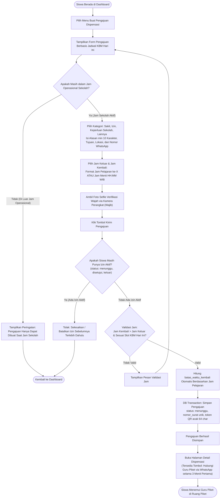
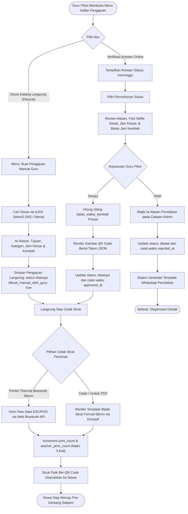
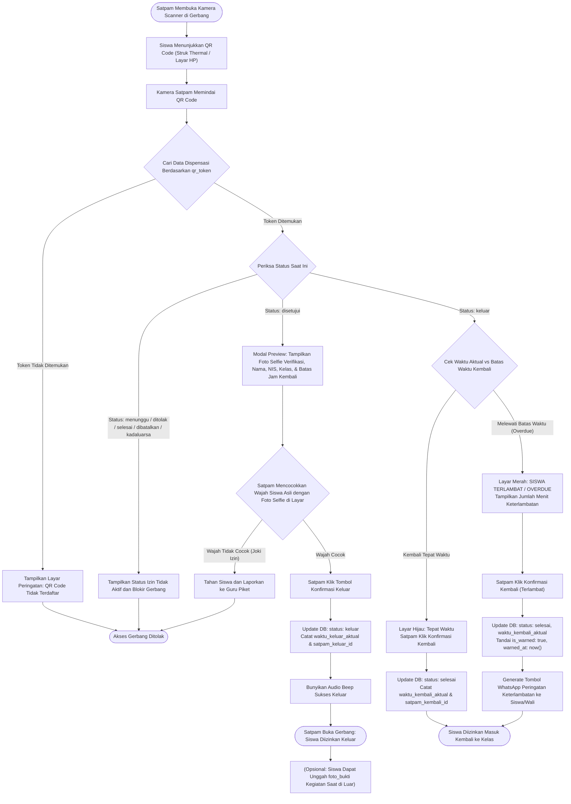
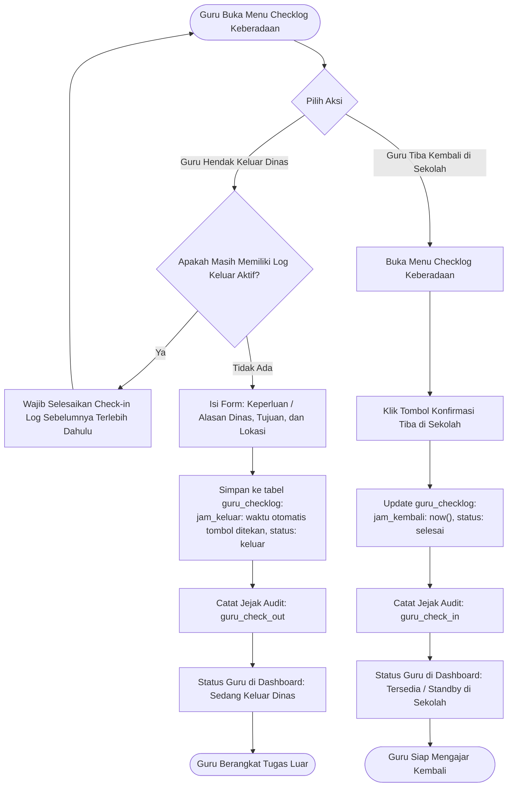
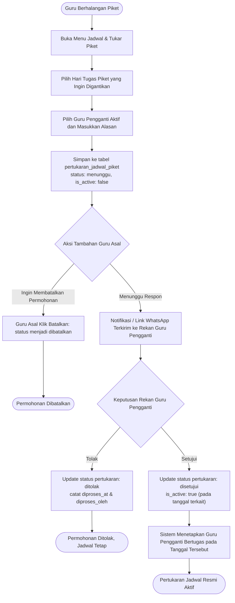
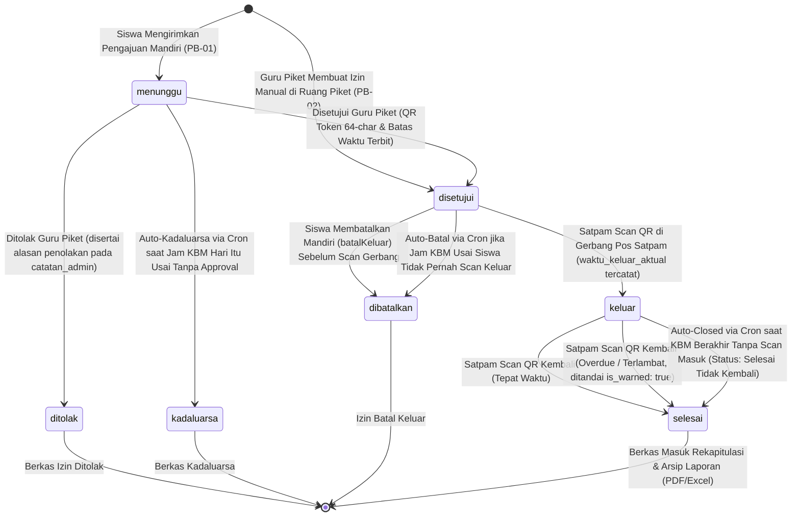

# SYSTEM FLOWCHARTS & PROCESS WORKFLOWS
## SISTEM DISPENSASI SISWA DIGITAL (DIDISPEN)
**SMK NEGERI 1 BANGSRI**

Dokumentasi diagram alir (*flowchart*) operasional sistem **DIDISPEN** yang memetakan seluruh interaksi pengguna (Siswa, Guru Piket, Satpam, Admin) dan integrasi eksternal (SiPintu Identity Gateway, Dynamic WhatsApp Engine, Scanner Gerbang, & Thermal Printer Bluetooth ESC/POS). Disinkronkan 100% dengan alur controller dan *state machine* aplikasi aktual.

---

## DAFTAR ISI DIAGRAM ALIR
1. [Flowchart 1: Autentikasi Multi-Role & Model Hybrid SiPintu SSO](#flowchart-1-autentikasi-multi-role--model-hybrid-sipintu-sso)
2. [Flowchart 2: Pengajuan Dispensasi Mandiri oleh Siswa & Selfie Verifikasi](#flowchart-2-pengajuan-dispensasi-mandiri-oleh-siswa--selfie-verifikasi)
3. [Flowchart 3: Verifikasi, Persetujuan, & Cetak Struk Guru Piket](#flowchart-3-verifikasi-persetujuan--cetak-struk-guru-piket)
4. [Flowchart 4: Pemindaian QR Code Pos Satpam & Deteksi Overdue](#flowchart-4-pemindaian-qr-code-pos-satpam--deteksi-overdue)
5. [Flowchart 5: Pencatatan Keberadaan Guru (Guru Checklog Dinas Luar)](#flowchart-5-pencatatan-keberadaan-guru-guru-checklog-dinas-luar)
6. [Flowchart 6: Manajemen & Pertukaran Jadwal Guru Piket](#flowchart-6-manajemen--pertukaran-jadwal-guru-piket)
7. [Flowchart 7: State Machine Siklus 7 Status Dispensasi & Auto-Complete KBM](#flowchart-7-state-machine-siklus-7-status-dispensasi--auto-complete-kbm)

---

## Flowchart 1: Autentikasi Multi-Role & Model Hybrid SiPintu SSO

Diagram ini memetakan 2 jalur masuk aplikasi DIDISPEN: **Jalur 1 (SSO Terpusat via SiPintu)** dan **Jalur 2 (Form Login Mandiri dengan Fallback Real-Time)** dilengkapi proteksi anti-brute force (*account locking*).

```mermaid
flowchart TD
    Start(["Mulai Akses DIDISPEN"]) --> Choice{"Pilih Jalur Masuk"}

    %% JALUR 1: SSO SIPINTU
    Choice -- "Jalur 1: SSO SiPintu" --> ClickPortal["Pengguna Klik Ikon DIDISPEN di Portal SiPintu"]
    ClickPortal --> RedirectCallback["Redirect ke /oauth/callback dengan Auth Code"]
    RedirectCallback --> ExchangeToken["Tukar Auth Code dengan Access Token Server-to-Server"]
    ExchangeToken --> FetchProfile["Ambil Profil Pengguna dari GET /api/v1/user"]
    FetchProfile --> MatchLocal{"Apakah Akun Ada di DB Lokal?"}
    
    MatchLocal -- "Tidak" --> AutoProvision["Auto-Provision Akun User dan Profil Siswa atau Guru"]
    MatchLocal -- "Ya" --> UpdateSync["Update Timestamp sipintu_last_synced_at"]
    
    AutoProvision --> ValidateRoleSSO{"Cek Role SSO"}
    UpdateSync --> ValidateRoleSSO
    ValidateRoleSSO -- "Admin" --> RejectSSO["Tolak SSO: Admin Wajib Login Manual"]
    RejectSSO --> ShowLogin
    ValidateRoleSSO -- "Siswa/Guru/Satpam" --> AuthLoginSSO["Autentikasi Login dan Regenerate Session"]

    %% JALUR 2: LOGIN MANUAL LOKAL
    Choice -- "Jalur 2: Login Manual" --> ShowLogin["Buka Halaman Login (/login)"]
    ShowLogin --> InputForm["Input NIS/NIP/Email, Password, dan Pilih Role"]
    InputForm --> CheckThrottle{"Gagal 5 Kali atau Lebih?"}
    
    CheckThrottle -- "Ya" --> AccountLocked["Akun Terkunci 15 Menit dan Catat Audit Log"]
    AccountLocked --> EndFail(["Selesai: Akses Ditolak"])
    
    CheckThrottle -- "Tidak" --> QueryUser{"Cari User di DB Lokal Sesuai Role"}
    QueryUser -- "Ditemukan" --> VerifyLocalHash{"Password Lokal Cocok?"}
    
    VerifyLocalHash -- "Ya" --> ResetThrottle["Reset Gagal Login ke 0"]
    ResetThrottle --> AuthLoginManual["Autentikasi Login Sesi Lokal"]

    %% FALLBACK KE SIPINTU GATEWAY
    QueryUser -- "Tidak Ditemukan dan Bukan Admin" --> CallFallback["Kirim Kredensial ke POST /api/v1/auth/verify-credentials"]
    VerifyLocalHash -- "Password Salah dan Bukan Admin" --> CallFallback
    
    CallFallback --> FallbackResult{"Respon SiPintu Valid?"}
    FallbackResult -- "Ya" --> UpdateLocalHash["Update Password Hash Baru di DB via Query Builder"]
    UpdateLocalHash --> EnsureProfile["Pastikan Relasi Profil Siswa atau Guru Tersedia"]
    EnsureProfile --> ResetThrottle
    
    FallbackResult -- "Tidak" --> IncThrottle["Increment failed_login_attempts"]
    IncThrottle --> LoginError["Tampilkan Pesan: NIS/Email atau Password Salah"]
    LoginError --> ShowLogin

    %% REDIRECT SESUAI ROLE
    AuthLoginSSO --> RouteDashboard{"Redirect Dashboard Sesuai Role"}
    AuthLoginManual --> RouteDashboard

    RouteDashboard -- "Role: Siswa" --> DashSiswa(["Masuk Dashboard Siswa"])
    RouteDashboard -- "Role: Guru" --> DashGuru(["Masuk Dashboard Guru"])
    RouteDashboard -- "Role: Satpam" --> DashSatpam(["Masuk Dashboard Satpam"])
    RouteDashboard -- "Role: Admin" --> DashAdmin(["Masuk Dashboard Admin"])
```

---

## Flowchart 2: Pengajuan Dispensasi Mandiri oleh Siswa & Selfie Verifikasi

Alur pengajuan izin dispensasi siswa secara mandiri berbasis jadwal KBM aktif sekolah, pencegahan pengajuan ganda (*concurrency lock*), dan pengambilan foto selfie wajah sebagai verifikasi identitas fisik di pos gerbang.

---

## Flowchart 3: Verifikasi, Persetujuan, & Cetak Struk Guru Piket

Alur kerja Guru Piket dalam memproses antrean pengajuan dispensasi siswa, persetujuan/penolakan, pembuatan dispensasi manual di ruang piket, serta pencetakan bukti fisik struk 58mm.

---

## Flowchart 4: Pemindaian QR Code Pos Satpam & Deteksi Overdue

Alur pemeriksaan perizinan 2 arah di gerbang sekolah oleh petugas Satpam (saat keluar dan kembali) dengan pencocokan identitas foto selfie verifikasi siswa di layar scanner.

---

## Flowchart 5: Pencatatan Keberadaan Guru (Guru Checklog Dinas Luar)

Pencatatan mobilitas guru yang sedang bertugas keluar atau dinas luar lingkungan sekolah beserta waktu tiba kembali.

---

## Flowchart 6: Manajemen & Pertukaran Jadwal Guru Piket

Alur pengajuan, pembatalan mandiri, dan persetujuan pergantian jadwal jaga piket antar-guru.

---

## Flowchart 7: State Machine Siklus 7 Status Dispensasi & Auto-Complete KBM

Diagram transisi status (*Lifecycle State Machine*) lengkap 7 status sesuai implementasi database enum dan scheduled task console command `dispensasi:auto-complete`.

