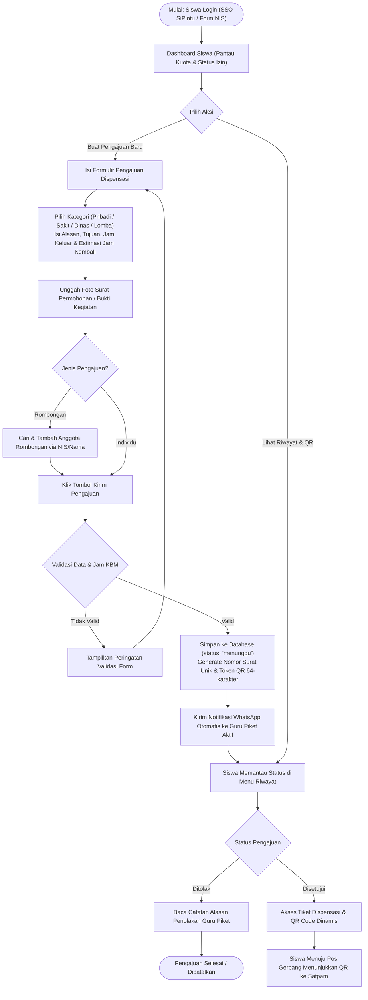
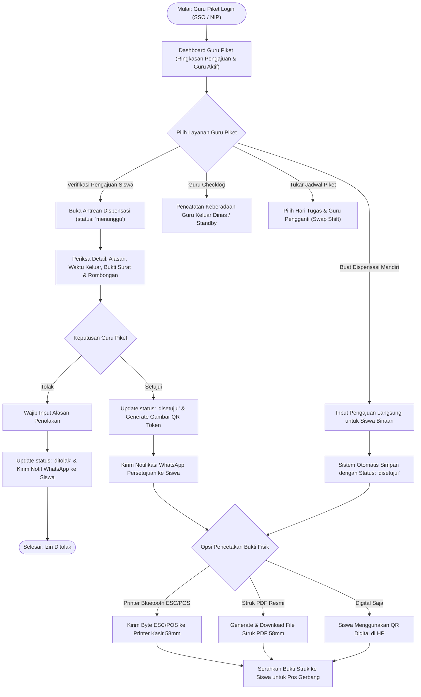
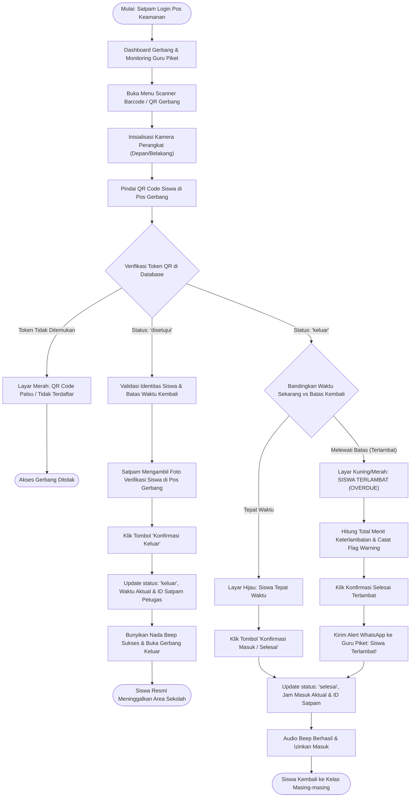
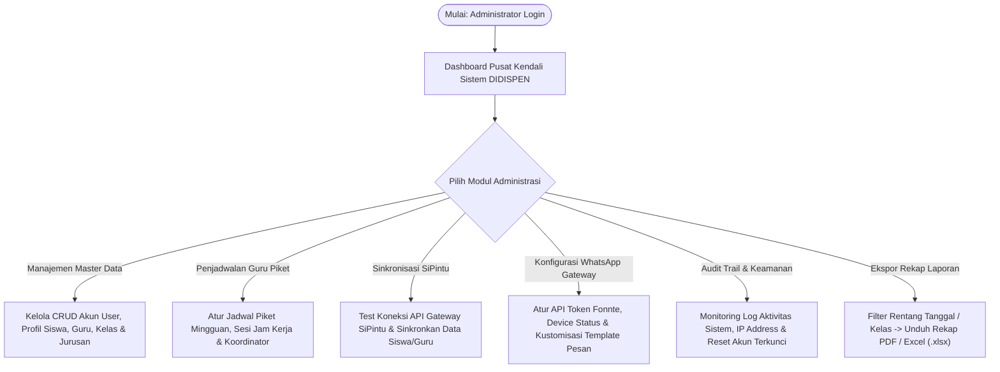

# 🚀 DIDISPEN — Digital Dispensasi Pendidikan
### **SMK NEGERI 1 BANGSRI**


---

## 📌 Tentang Proyek

**DIDISPEN (Digital Dispensasi Pendidikan)** adalah platform manajemen perizinan dispensasi keluar-masuk siswa berbasis web (*web-based*) yang dirancang khusus dan diimplementasikan secara terintegrasi di **SMK Negeri 1 Bangsri**. 

Sistem ini mentransformasi seluruh alur perizinan manual berbahan kertas (*paperless*) menjadi ekosistem digital terpadu secara *real-time*: mulai dari permohonan izin mandiri/rombongan oleh siswa, verifikasi dan tanda tangan digital oleh Guru Piket, pemindaian **Kode QR Dinamis** dan pengambilan foto verifikasi di pos Satpam, hingga integrasi notifikasi otomatis via **WhatsApp Gateway** dan pencetakan fisik struk bukti izin melalui **Printer Thermal Bluetooth (ESC/POS 58mm)**.

### ✨ Fitur Unggulan Sistem:
- 🔐 **Multi-Role Access Control**: 4 panel dashboard berdedikasi tinggi dengan otorisasi ketat untuk **Siswa**, **Guru Piket**, **Satpam Gerbang**, dan **Administrator**.
- 🔄 **Hybrid SSO SiPintu Integration**: Otentikasi terpadu melalui *OAuth2 / REST API SiPintu Gateway* sekolah dilengkapi sinkronisasi data master siswa/guru dan mekanisme *fallback login* otomatis.
- 📱 **Dynamic 64-char QR Token**: QR Code sekali pakai (*single-use lifecycle*) dengan enkripsi token acak 64 karakter guna mencegah manipulasi, penggandaan, atau pemalsuan izin.
- ⏱️ **Real-Time Lifecycle State Machine**: Pemantauan status perizinan langsung: `menunggu` $\rightarrow$ `disetujui` / `ditolak` $\rightarrow$ `keluar` $\rightarrow$ `selesai` (dengan deteksi keterlambatan *overdue* otomatis).
- 🖨️ **Web Bluetooth Thermal Printing (58mm)**: Cetak bukti izin fisik langsung dari browser Chrome/Edge ke printer thermal kasir/portable via Bluetooth Low Energy (BLE) maupun unduhan format Struk PDF resmi.
- 📸 **Gate Photo Verification**: Pengambilan foto fisik siswa secara *live* di pos gerbang oleh Satpam saat siswa meninggalkan sekolah untuk bukti dokumentasi otentik.
- 💬 **WhatsApp Notification Gateway**: Pengiriman notifikasi status persetujuan, penolakan, pengingat kembali, serta peringatan siswa terlambat secara instan melalui integrasi Fonnte API.
- 📋 **Guru Checklog & Swap Schedule**: Modul pencatatan guru piket yang keluar tugas dinas luar serta sistem pengajuan pertukaran jadwal jaga piket (*shift swap*) antar-guru.
- 📊 **Pelaporan & Analitik**: Ekspor rekapitulasi data dispensasi periode harian/bulanan ke format **Excel (.xlsx)** dan **PDF**.

---

## 👥 Tim Pengembang (By 3M)
Aplikasi dikembangkan dengan dedikasi penuh untuk kemajuan digitalisasi **SMKN 1 Bangsri** oleh Tim **By 3M**:
* 👨‍💻 **Maulana Fahri Oktavian**
* 👨‍💻 **Muhammad Sabrian Nuh**
* 👨‍💻 **Muhammad Zainal Arief**

---

## 📐 Dokumentasi Teknis & Metodologi (Scrum, Flowchart, & ERD)

Untuk keperluan pengujian teknis, audit kode, dan penilaian Uji Kompetensi Keahlian (UKK), dokumentasi arsitektur dan metodologi rekayasa perangkat lunak telah disusun lengkap pada berkas terpisah:

| Dokumen | Deskripsi Berkas | Tautan Dokumen |
| :--- | :--- | :--- |
| **Diagram Alir (Flowcharts)** | 7 Diagram Alir Mermaid mencakup SSO SiPintu, Pengajuan Siswa, Approval Guru, Scanner Gerbang, Checklog, Swap Piket, dan State Machine. | 📄 [FLOWCHART.MD](file:///home/zainal/Documents/Digipen/FLOWCHART.MD) |
| **Basis Data (ERD & Data Dictionary)** | Rancangan relasi database, skema tabel, tipe data, indeks foreign key, serta kamus data lengkap. | 📄 [ERD.MD](file:///home/zainal/Documents/Digipen/ERD.MD) |
| **Metodologi Agile (Scrum)** | Product Vision Board, Product Backlog (PB-01 s/d PB-08), Sprint Planning, Story Points, User Stories, dan Acceptance Criteria. | 📄 [SCRUM.MD](file:///home/zainal/Documents/Digipen/SCRUM.MD) *(Lihat juga: `SCRUM UKK (revisi).pdf`)* |

---

## 📊 Diagram Alir Operasional per Role (Flowchart)

Berikut adalah diagram alir operasional sistem DIDISPEN yang dipetakan secara spesifik untuk masing-masing peran pengguna:

### 1. 👨‍🎓 Alur Operasional Pengguna: SISWA


---

### 2. 👨‍🏫 Alur Operasional Pengguna: GURU PIKET


---

### 3. 👮‍♂️ Alur Operasional Pengguna: SATPAM (Pos Gerbang)


---

### 4. 👨‍💼 Alur Operasional Pengguna: ADMINISTRATOR


---

## ⚙️ Spesifikasi & Persyaratan Sistem

| Komponen | Kebutuhan Minimum | Keterangan / Rekomendasi |
| :--- | :--- | :--- |
| **PHP Version** | `>= 8.2` | Direkomendasikan PHP 8.2 atau 8.3 |
| **Framework** | `Laravel 11.x` | Arsitektur MVC modern dengan Service-Repository pattern |
| **Database** | MySQL / MariaDB `>= 10.4` | Mendukung Foreign Keys & Transactions InnoDB |
| **Node.js & NPM** | `Node.js >= 18.x`, `NPM >= 9.x` | Untuk instalasi library frontend Tailwind CSS |
| **Ekstensi PHP Wajib** | `php-gd`, `php-pdo`, `php-mbstring`, `php-xml`, `php-curl`, `php-zip` | `php-gd` wajib untuk render QR Code |
| **Hardware Pos Satpam** | Smartphone Android / Laptop / Webcam | Wajib mendukung browser berkamera & Web Bluetooth API |
| **Printer Thermal** | Mini POS Printer 58mm (Bluetooth BLE / USB) | Mendukung perintah ESC/POS standar |

---

## 🛠️ Panduan Instalasi (Developer / Local Environment)

Ikuti instruksi langkah demi langkah di bawah ini untuk menjalankan DIDISPEN di server lokal:

### 1. Clone Repository & Masuk ke Direktori
```bash
git clone https://github.com/Zainal29/Didispen.git
cd Didispen
```

### 2. Install Dependensi Composer & Node.js
```bash
# Install paket PHP pihak ketiga
composer install

# Install dependensi frontend dan bangun aset
npm install
npm run build
```

### 3. Konfigurasi Environment (`.env`)
Duplikat berkas template `.env.example` menjadi `.env`:
```bash
cp .env.example .env
```
Buka berkas `.env` dan sesuaikan pengaturan database Anda:
```env
APP_NAME=DIDISPEN
APP_ENV=local
APP_KEY=
APP_DEBUG=true
APP_URL=http://localhost:8000

DB_CONNECTION=mysql
DB_HOST=127.0.0.1
DB_PORT=3306
DB_DATABASE=db_didispen
DB_USERNAME=root
DB_PASSWORD=

# Konfigurasi WhatsApp Gateway (Fonnte)
FONNTE_TOKEN=your_fonnte_device_token_here

# Konfigurasi SiPintu Gateway
SIPINTU_API_URL=https://sipintu.smkn1bangsri.sch.id/api/v1
SIPINTU_API_KEY=your_sipintu_api_key_here
```

### 4. Generate Application Key & Storage Symlink
```bash
php artisan key:generate
php artisan storage:link
```
> [!IMPORTANT]
> Perintah `php artisan storage:link` **wajib dijalankan** agar file foto bukti surat, foto verifikasi pos satpam, dan gambar QR Code dapat diakses dari browser melalui URL publik.

### 5. Migrasi Skema Database & Jalankan Seeder
Pastikan database kosong (misal: `db_didispen`) telah dibuat di MySQL, lalu jalankan:
```bash
php artisan migrate:fresh --seed
```

### 6. Jalankan Server Pengembangan
```bash
php artisan serve
```
Akses aplikasi melalui peramban web di: **`http://127.0.0.1:8000`**

---

## 📖 Panduan Penggunaan Lengkap (User Manual per Role)

---

### 👨‍🎓 1. Panduan Lengkap untuk SISWA
Akses panel siswa dirancang ramah ponsel (*mobile-first*), memudahkan pengajuan izin dispensasi langsung dari genggaman:

1. **Login Akun Siswa**:
   - Buka halaman login `/login`.
   - Masukkan **NIS** (Nomor Induk Siswa) dan password yang terdaftar (atau klik tautan **SSO SiPintu** jika menggunakan portal terpadu sekolah).
2. **Membuat Pengajuan Dispensasi Baru**:
   - Pada halaman Dashboard, tekan tombol **"+ Ajukan Dispensasi"**.
   - **Kategori Izin**: Pilih kategori yang sesuai:
     - 🩺 *Sakit*: Memerlukan istirahat di UKS atau pulang berobat.
     - 🏠 *Izin Pribadi*: Keperluan mendesak keluarga.
     - 🏢 *Tugas / Dinas Sekolah*: Tugas kepengurusan OSIS, administrasi sekolah, dll.
     - 🏆 *Lomba / Kegiatan Luar*: Mewakili sekolah dalam kompetisi atau seminar.
   - **Form Waktu**: Tentukan jam mulai keluar dan perkiraan jam kembali ke sekolah.
   - **Alasan & Lokasi Tujuan**: Tuliskan alasan dispensasi secara jelas serta alamat/tujuan lokasi.
   - **Bukti Surat / Foto**: Ambil foto surat izin orang tua / surat tugas sekolah melalui kamera ponsel atau galeri.
   - **Pengajuan Rombongan**: Jika dispensasi diikuti oleh lebih dari 1 siswa, centang opsi rombongan, lalu cari nama/NIS rekan Anda untuk ditambahkan ke dalam berkas yang sama.
   - Tekan **"Kirim Pengajuan"**.
3. **Memantau Status & Menghubungi Guru Piket**:
   - Pengajuan akan berstatus **"Menunggu"** (badge kuning). Sistem secara otomatis mengirimkan notifikasi WhatsApp kepada Guru Piket yang sedang bertugas.
   - Tersedia tombol cepat **"Hubungi Guru Piket"** via WhatsApp di Dashboard dengan pesan terformat otomatis jika Anda memerlukan verifikasi darurat di ruang piket.
4. **Pengambilan Tiket QR Code**:
   - Segera setelah Guru Piket menyetujui, status akan berubah menjadi **"Disetujui"** (badge hijau).
   - Buka menu **"Riwayat Pengajuan"** $\rightarrow$ klik **"Lihat Tiket / QR Code"**.
   - Tiket memuat token 64-karakter dalam bentuk QR Code, batas jam kembali, dan nomor surat resmi.
5. **Proses di Pos Gerbang Satpam**:
   - Tunjukkan QR Code pada layar ponsel kepada petugas Satpam di gerbang sekolah saat keluar.
   - Saat kembali ke sekolah, kembali hampiri petugas Satpam untuk memindai QR Code masuk guna menandai izin telah **"Selesai"**.

---

### 👨‍🏫 2. Panduan Lengkap untuk GURU PIKET
Guru Piket memegang otoritas validasi perizinan, penerbitan tiket izin, dan pencatatan fisik:

1. **Login & Dashboard Guru**:
   - Masuk menggunakan **NIP** atau Email terdaftar.
   - Dashboard menampilkan ringkasan pengajuan hari ini, sesi piket yang sedang aktif, daftar guru rekan piket, dan status siswa yang sedang berada di luar sekolah.
2. **Verifikasi Antrean Pengajuan (Approval / Penolakan)**:
   - Masuk ke menu **"Verifikasi Dispensasi"**.
   - Klik baris pengajuan untuk meninjau: identitas siswa, kelas, alasan, jam izin, dan foto dokumen pendukung.
   - **Jika Disetujui**: Klik tombol **"Setujui"**. Sistem seketika menerbitkan QR Token resmi dan mengirim notifikasi WhatsApp konfirmasi kepada siswa.
   - **Jika Ditolak**: Klik tombol **"Tolak"**. Anda **wajib** menuliskan catatan alasan penolakan (misal: *"Jam KBM sedang berlangsung ujian"*). Siswa akan menerima notifikasi alasan penolakan tersebut.
3. **Pencetakan Bukti Fisik Struk Thermal 58mm**:
   - Untuk siswa yang tidak membawa ponsel atau memerlukan izin fisik bertanda tangan gerbang, Guru Piket dapat mencetak struk kasir 58mm:
     - **Metode 1 (Web Bluetooth Direct)**: Klik tombol **"Cetak Bluetooth"**, pilih nama printer thermal kasir Anda (misal: *RPP02N / MPT-II*). Sistem mengirimkan instruksi raw ESC/POS dalam hitungan detik tanpa driver tambahan.
     - **Metode 2 (Struk PDF)**: Klik tombol **"Download PDF"** untuk mengunduh struk ukuran 58mm berformat PDF yang siap dicetak dari aplikasi printer default komputer.
4. **Membuat Dispensasi Mandiri oleh Guru**:
   - Jika guru membawa siswa keluar untuk kegiatan dinas mendadak, Guru dapat menggunakan menu **"Dispensasi Mandiri"**. Dispensasi yang diinput guru langsung berstatus **"Disetujui"** tanpa melalui antrean verifikasi.
5. **Modul Guru Checklog (Tugas Luar Guru)**:
   - Buka menu **"Guru Checklog"** apabila Anda selaku guru piket perlu meninggalkan area sekolah sementara untuk urusan dinas.
   - Masukkan alasan tugas dinas dan perkiraan jam kembali, lalu klik **"Check-Out Dinas"**.
   - Saat tiba kembali di sekolah, klik **"Konfirmasi Kembali"** agar status Anda di sistem kembali aktif (*standby*).
6. **Modul Pertukaran Jadwal Piket (Shift Swap)**:
   - Jika berhalangan bertugas pada hari piket tertentu, buka menu **"Tukar Jadwal Piket"**.
   - Pilih jadwal yang ingin ditukarkan, tentukan nama guru pengganti, dan sertakan alasan.
   - Permintaan akan diteruskan ke guru pengganti untuk disetujui. Setelah disetujui, jadwal harian akan otomatis diperbarui.

---

### 👮‍♂️ 3. Panduan Lengkap untuk SATPAM (Pos Keamanan Gerbang)
Petugas Satpam bertindak sebagai gerbang validasi fisik utama keluar-masuk siswa:

1. **Dashboard & Informasi Guru Piket Hari Ini**:
   - Dashboard Satpam dilengkapi kartu responsif **"Guru Piket Hari Ini"** yang menampilkan nama guru yang sedang bertugas di meja piket sesi saat ini, status ketersediaan, serta tombol direct call dan WhatsApp untuk koordinasi cepat dari gerbang ke ruang piket.
2. **Izin Kamera & Akses Scanner**:
   - Klik tombol utama **"Scan QR Dispensasi"**.
   - Saat browser meminta izin akses kamera, pastikan memilih **"Allow" / "Izinkan"**.
   - Anda dapat memilih kamera depan atau belakang serta menyalakan senter flash melalui kontrol di layar.
3. **Pemeriksaan Siswa Keluar (Check-Out Gerbang)**:
   - Siswa memperlihatkan QR Code dari ponsel atau struk thermal.
   - Satpam mengarahkan kamera ke QR Code tersebut.
   - Layar akan menampilkan profil siswa, foto siswa, alasan dispensasi, serta batas waktu kembali.
   - **Pengambilan Foto Verifikasi Pos Gerbang**: Satpam menekan tombol kamera di pos untuk mengambil foto fisik siswa di gerbang sebagai bukti otentik bahwa siswa bersangkutan benar-benar meninggalkan sekolah bersama seragam/atributnya.
   - Klik tombol **"Konfirmasi Keluar"**. Terdengar bunyi audio *beep* sukses, status berubah menjadi **"Keluar"**, dan siswa diizinkan keluar melewati gerbang.
4. **Pemeriksaan Siswa Kembali (Check-In Gerbang)**:
   - Saat siswa kembali ke sekolah, pindai kembali QR Code siswa di menu scanner.
   - Sistem melakukan evaluasi waktu secara otomatis:
     - 🟢 **Kembali Tepat Waktu**: Layar menampilkan warna hijau. Klik **"Konfirmasi Masuk"**. Status berubah menjadi **"Selesai"**.
     - 🔴 **Melewati Batas (Terlambat / Overdue)**: Layar menampilkan warna kuning/merah menyala dengan rincian total menit keterlambatan. Satpam mengklik **"Konfirmasi Selesai (Overdue)"**. Sistem mencatat flag keterlambatan dan secara otomatis mengirimkan notifikasi *alert* keterlambatan ke WhatsApp Guru Piket.
5. **Pemantauan Siswa Sedang Keluar di Dashboard**:
   - Jika kamera mengalami kendala, Satpam dapat memeriksa tab **"Siswa Sedang Keluar"** di Dashboard, melihat sisa waktu, dan melakukan konfirmasi kembali secara manual.

---

### 👨‍💼 4. Panduan Lengkap untuk ADMINISTRATOR
Administrator memegang kendali penuh atas konfigurasi sistem, integritas data, dan audit keamanan:

1. **Manajemen Master Data Terpadu**:
   - Melalui menu navigasi admin, kelola data:
     - 👨‍🎓 **Data Siswa**: NIS, Nama, Kelas, Jurusan, Nomor HP Orang Tua, Status Aktif.
     - 👨‍🏫 **Data Guru**: NIP, Nama Lengkap, Mata Pelajaran, Nomor HP WhatsApp.
     - 👮‍♂️ **Data Satpam**: Akun petugas pos gerbang.
     - 🏫 **Kelas & Jurusan**: Struktur rombel pendidikan SMKN 1 Bangsri.
2. **Pengaturan Jadwal & Sesi Guru Piket**:
   - Kelola jadwal piket per hari (Senin s/d Jumat) lengkap dengan pembagian sesi waktu kerja (contoh: Sesi 1: 07:00–11:30 WIB, Sesi 2: 11:30–15:30 WIB).
   - Menetapkan guru koordinator dan anggota tim piket pada masing-masing sesi.
3. **Integrasi & Sinkronisasi SiPintu Gateway**:
   - Buka menu **"Sinkronisasi SiPintu"**.
   - Gunakan tombol **"Test Koneksi"** untuk memverifikasi handshake ke API Server SiPintu SMKN 1 Bangsri.
   - Jalankan **"Sinkronisasi Massal"** untuk menyelaraskan data mutasi siswa baru atau perubahan data guru secara otomatis tanpa perlu input manual satu per satu.
4. **Konfigurasi WhatsApp Gateway (Fonnte)**:
   - Masukkan token perangkat Fonnte, cek status konektivitas nomor bot, dan kustomisasi variabel template pesan notifikasi persetujuan/peringatan dispensasi.
5. **Audit Trail & Keamanan Sistem**:
   - Menu **"Audit Logs"** merekam setiap aksi penting: waktu login, IP address pengguna, pembuatan dispensasi, persetujuan guru, waktu scan gerbang, hingga percobaan gagal login.
   - Fitur proteksi *brute-force* otomatis mengunci akun pengguna selama 15 menit jika terjadi 5 kali kegagalan autentikasi berturut-turut.
6. **Laporan & Rekapitulasi Data**:
   - Buka menu **"Laporan Dispensasi"**.
   - Tentukan filter rentang tanggal, filter per kelas/jurusan, atau filter kategori izin.
   - Unduh berkas rekapitulasi dalam format **Excel (.xlsx)** untuk arsip tata usaha atau cetak ringkasan eksekutif berformat **PDF**.

---

## ⚠️ Troubleshooting & FAQ (Pemecahan Masalah)

| Kendala / Masalah | Penyebab Umum | Langkah Solusi Praktis |
| :--- | :--- | :--- |
| **Kamera Scanner Satpam tidak mau menyala** | Browser membatasi akses webcam pada koneksi non-HTTPS. | Akses aplikasi melalui protokol aman `https://` (di production) atau `http://localhost` / `http://127.0.0.1` (di lingkungan lokal). Izinkan *Camera Permission* pada pengaturan browser. |
| **QR Code tidak muncul / gambar rusak (*Broken Image*)** | Symlink direktori storage Laravel belum terbentuk. | Jalankan perintah terminal: `php artisan storage:link`. Pastikan folder `public/storage` dapat diakses oleh web server. |
| **Printer Bluetooth tidak terdeteksi saat Cetak Thermal** | Bluetooth perangkat belum aktif atau browser belum mendukung Web Bluetooth API. | Gunakan browser **Google Chrome** atau **Microsoft Edge** versi terbaru pada komputer/ponsel dengan Bluetooth menyala. Pastikan printer thermal dalam kondisi *Pairing Mode*. |
| **Notifikasi WhatsApp tidak terkirim** | Token Fonnte belum dikonfigurasi di `.env` atau masa aktif paket Fonnte telah habis. | Periksa variabel `FONNTE_TOKEN` di berkas `.env` dan pastikan perangkat WhatsApp bot di dasbor Fonnte berstatus *Connected*. |
| **Gagal Sinkronisasi dengan SiPintu** | Endpoint API sekolah tidak merespons atau kredensial API salah. | Periksa koneksi internet server dan verifikasi `SIPINTU_API_URL` serta `SIPINTU_API_KEY` di berkas `.env`. |
| **Tampilan CSS berantakan / Icon tidak muncul** | Cache tampilan belum diperbarui atau aset frontend belum dibangun. | Jalankan `npm run build`, lalu bersihkan cache dengan perintah `php artisan optimize:clear`. |

---

## 📂 Struktur Direktori Utama Proyek

```text
DIDISPEN (Digipen)
├── app/
│   ├── Http/
│   │   ├── Controllers/
│   │   │   ├── Admin/            # Pengendali Panel Admin & Master Data
│   │   │   ├── Guru/             # Pengendali Panel Guru Piket & Approval
│   │   │   ├── Satpam/           # Pengendali Portal Pos Gerbang & Scanner QR
│   │   │   ├── Siswa/            # Pengendali Pengajuan & Riwayat Siswa
│   │   │   └── Auth/             # Otentikasi Multi-Role & Callback SSO
│   │   └── Middleware/           # Proteksi Hak Akses Role & Throttle
│   ├── Models/                   # Definisi Eloquent (User, Siswa, Guru, Dispensasi, dll)
│   └── Services/                 # Business Logic (SipintuService, GuruPiketService, EscPosHelper)
├── config/                       # Konfigurasi Layanan (Auth, Database, Services)
├── database/
│   ├── migrations/               # Skema Migrasi Struktur Tabel Basis Data
│   └── seeders/                  # Seeder Akun Demo & Data Awal
├── public/
│   ├── images/                   # Asset Logo DIDISPEN & Branding Sekolah
│   └── storage/                  # Tautan Simbolik File Unggahan & QR Token
├── resources/
│   └── views/                    # Tampilan Blade UI Berbasis TailwindCSS
│       ├── admin/                # Komponen Antarmuka Admin
│       ├── guru/                 # Komponen Antarmuka Guru Piket & Struk
│       ├── satpam/               # Antarmuka Dashboard Pos Gerbang & Scan QR
│       ├── siswa/                # Antarmuka Dashboard & Pengajuan Siswa
│       └── layouts/              # Template Induk Tata Letak
├── routes/
│   └── web.php                   # Pemetaan Rute URL Aplikasi
├── ERD.MD                        # Dokumentasi Skema Basis Data & Kamus Data
├── FLOWCHART.MD                  # Dokumentasi Diagram Alir Teknis Lengkap
├── SCRUM.MD                      # Lembar Kerja Agile Development & User Stories
└── README.md                     # Dokumentasi Utama Repository Proyek
```

---

© 2026 **DIDISPEN — SMK Negeri 1 Bangsri**. All rights reserved.  
Dirancang dan dibangun dengan integritas tinggi oleh **Tim By 3M** *(Maulana Fahri Oktavian • Muhammad Sabrian Nuh • Muhammad Zainal Arief)*.
